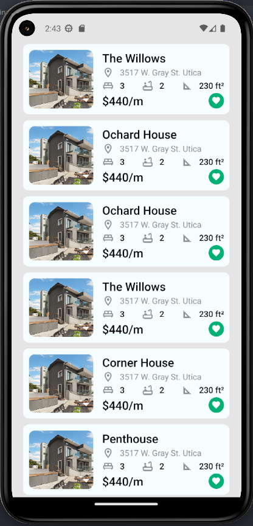

# App Inmobiliaria

This is a single-page application that showcases properties from a real estate agency.

## Features

- Display a variety of properties from the real estate agency, obtained from a JSON file
- View detailed information and images of each property, including:
  - Property name
  - Address
  - Number of bedrooms
  - Number of bathrooms
  - Square footage
  - Rental price
  - Rating
  - Like button for favoriting properties

## Technologies Used

- React Native
- Expo
- Prop-types
- @expo/vector-icons
- eslint
- Other packages and dependencies (see `package.json` file for more details)

## Screenshots

## Installation

Follow these steps to install and run the application:

1. Clone this repository to your local machine: git clone https://github.com/YourUsername/YourRepository.git

2. Navigate to the project directory:

3. Install the necessary dependencies using npm or yarn:

npm install or yarn install

4. Start the Expo development server:

expo start

## Credits

- Developed by [Derek Ayala](https://github.com/DerekAyala)
